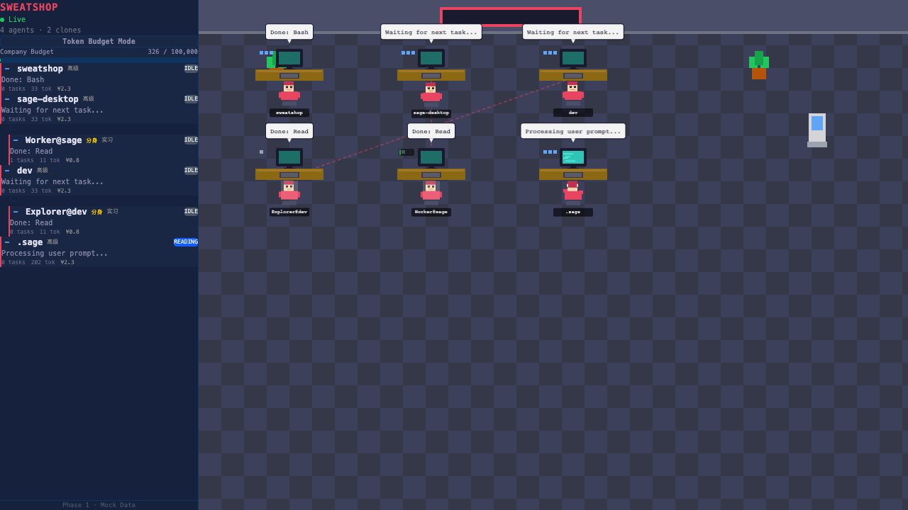

# ai-sweatshop

> Watch your AI agents work in a pixel-art virtual office.

A fun, open-source monitoring dashboard that visualizes AI coding agents (Claude Code, Codex, Gemini CLI, etc.) as pixel-art office workers. Each agent gets a desk, a monitor with scrolling code, and a speech bubble showing what they're doing in real-time.



## Features

- **Pixel-art office** — Each AI agent becomes an animated pixel worker with their own workstation
- **Real-time monitoring** — Hooks into Claude Code events (tool calls, sub-agents, session lifecycle)
- **Shadow Clone (影分身)** — Sub-agents appear as team members with animated connecting lines
- **Performance tracking** — S/A/B/C/D ranking based on task completion vs token consumption
- **Token budget** — Shared pool with salary tiers (Claude = senior, Codex = mid, Gemini = junior)
- **Right-click management** — Promote, demote, raise salary, or fire agents
- **Dynamic animations** — Breathing, typing hands, eye blinking, screen scrolling, speech bubble typewriter
- **Live/Mock modes** — Works with real agent data or standalone demo mode
- **MCP Plugin** — Install as a Claude Code plugin for seamless integration

## Quick Start

### As a Claude Code Plugin (recommended)

```bash
claude mcp add ai-sweatshop -- npx ai-sweatshop --mcp
```

Then restart Claude Code. The pixel office runs at http://localhost:7777 and Claude gets tools to query office status.

### Standalone

```bash
npx ai-sweatshop
```

Opens the pixel office in your browser. Automatically injects Claude Code hooks for real-time monitoring.

### Uninstall hooks

```bash
npx ai-sweatshop --uninstall
```

## How It Works

```
Claude Code session
  ├── PreToolUse hook  ──→  Bridge Server (:7777)  ──→  WebSocket  ──→  Pixel Office
  ├── SubagentStart    ──→  New worker appears with desk + poof animation
  ├── PostToolUse      ──→  Worker status updates (typing/reading/running/idle)
  ├── Stop             ──→  Worker goes idle (stays in office)
  └── SessionEnd       ──→  Worker leaves the office
```

The bridge server receives hook events via HTTP POST, maintains agent state, and pushes updates to the browser via WebSocket. The frontend renders everything with PixiJS.

## MCP Tools

When installed as a plugin, Claude gets these tools:

| Tool | Description |
|------|-------------|
| `list_agents` | See who's in the office and what they're doing |
| `agent_status` | Get detailed status of a specific agent |
| `office_summary` | Overview: active/idle counts, projects, team structure |

## Agent Naming

- **Main agents** are named after their project directory (e.g., `sweatshop`, `sage`)
- **Sub-agents** show their role (e.g., `Explorer@sweatshop`, `Reviewer@sage`)

## Tech Stack

- **Frontend**: React 19 + PixiJS v8 + @pixi/react + Zustand + Tailwind CSS
- **Bridge**: Node.js HTTP + WebSocket server (~250 lines)
- **MCP**: @modelcontextprotocol/sdk
- **Hooks**: Claude Code async HTTP hooks with `quiet: true`

## Development

```bash
git clone https://github.com/evanliu009/ai-sweatshop.git
cd ai-sweatshop
npm install
npm run dev      # Vite dev server with HMR
npm run build    # Production build
npm start        # Start bridge + open browser
```

## License

MIT
